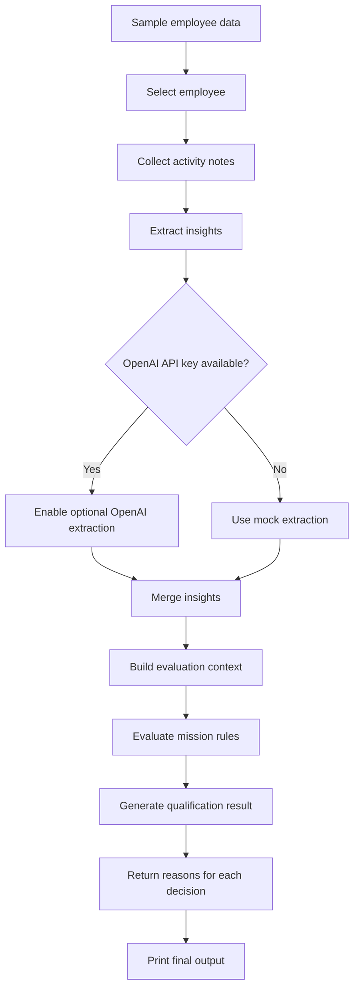

# Employee Insights Engine
> Applies business rules to employee activity data and insights extracted from notes to decide who qualifies for missions, incentives, or follow-up actions, with clear reasons behind each decision.

> ⚠️ This project was built to explore concepts such as type-safe DSL design, rule evaluation, structured insight extraction as a study and learning exercise. It was partly inspired by [this article](https://medium.com/@reidev275/creating-a-type-safe-dsl-for-filtering-in-typescript-53fe68a7942e).

- [Quick Start](#quick-start)
- [What This Project Does](#what-this-project-does)
- [Demo Behavior](#demo-behavior)
- [Execution Flow](#execution-flow)
- [Structure](#structure)
- [Technical Decisions](#technical-decisions)

## Quick Start

Requirements:

- Node.js 20+
- npm 10+

```bash
npm install
```

Run the demo:

```bash
npm start
```

By default, the demo uses the deterministic mock extractor.
If you want to enable the optional OpenAI extractor as an extra, provide your API key when starting the app:

```bash
OPENAI_API_KEY=your_openai_key npm start
```

To run the automated tests:

```bash
npm test
```

## What This Project Does

This project evaluates mission eligibility for employees based on:

- Employee profile data
- Activity log notes
- Structured insights extracted from those notes
- A JSON rule DSL

The included demo loads sample employees, extracts insights from their logs, evaluates each mission, and prints both the qualification result and the reasons behind it.

## Demo Behavior

`npm start` runs the sample dataset in [src/index.ts](src/index.ts) and prints:

- The employee being evaluated
- The extracted insights
- Each mission result
- The explanation for why the rule matched or failed

The extraction layer is isolated behind an `InsightExtractor` interface:

- `MockInsightExtractor` is deterministic and used by default for local reliability
- `LLMInsightExtractor` is an optional extra that uses the AI SDK with schema-validated structured output

Example outcomes from the current demo data:

- Ana Torres qualifies for `High Performer`, `Referral Champion`, and `Compliance Safe`
- Michael Carter does not qualify for `High Performer` or `Referral Champion`, but still qualifies for `Compliance Safe`

Follow the execution flow below to see how the data moves from sample input to final output:

## Execution Flow



## Structure

```text
src/
  data/        sample employees, logs, and missions
  domain/      domain types and qualification service
  engine/      DSL, field resolution, and rule evaluation
  insights/    schema, extractors, prompt builder, and orchestration
tests/         automated tests
```

## Technical Decisions

Key design decisions are documented in the ADRs:

- [ADR-001](/Users/dtorres/Projects/Jolly_Challenge/docs/adr/ADR-001-json-dsl-for-rules.md): Use a JSON rule DSL instead of scattered conditionals.
- [ADR-002](/Users/dtorres/Projects/Jolly_Challenge/docs/adr/ADR-002-insight-extraction-mock-plus-optional-llm.md): Default to a deterministic mock extractor and treat the OpenAI path as an optional extra.
- [ADR-003](/Users/dtorres/Projects/Jolly_Challenge/docs/adr/ADR-003-recursive-rule-evaluator.md): Use a recursive evaluator with isolated operators for clarity and easy extension.
- [ADR-004](/Users/dtorres/Projects/Jolly_Challenge/docs/adr/ADR-004-class-based-extractors.md): Use classes for extractors to keep the interface consistent and leave room for future dependencies or configuration.
